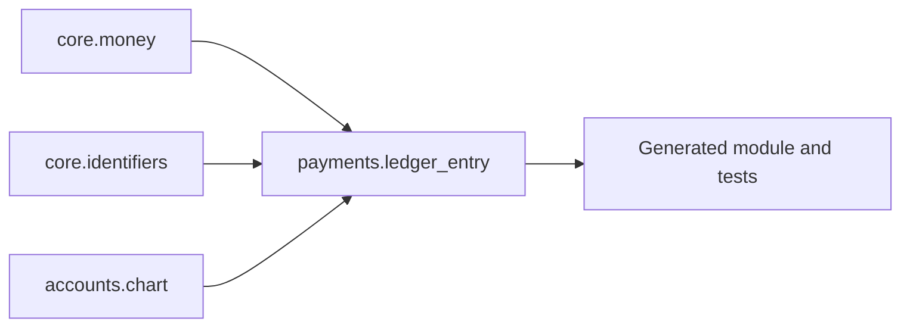

# How to Write a Design Doc That an Agent Can Actually Build From

Most design docs are written for a meeting.

They explain the idea, establish that somebody has thought about the problem, and give everyone enough confidence to say “sounds good.” Then implementation starts, details migrate into Slack, and six weeks later the document is technically still correct in the same way an old map is technically still paper.

That format is fine when the code is the durable artifact.

It breaks down when you want an agent to regenerate the code from the document.

For an agent-native workflow inspired by [Design Docs Are All You Need](https://www.alphaxiv.org/abs/2609.05364), the design doc is not a description of the implementation. It is the implementation’s **source specification**. The code is generated output. <alphaxiv-paper-citation paper="2609.05364v1" title="Design Docs" page="2" first="To solve these problems" last="complete regeneration workflow is illustrated in Figure 1.">

That changes how you write.

You are no longer trying to persuade a reviewer that the architecture is sensible. You are trying to make it impossible, or at least inconvenient, for an agent to misunderstand what must be built.

The good news is that this produces better docs for humans too. The bad news is that vague sentences become much more embarrassing.

---

## Start by choosing one thing the document owns

The first mistake is making one document describe an entire system.

Don’t write:

```text
payments-service.md
```

Write:

```text
payments.ledger-entry.md
payments.authorization.md
payments.settlement.md
payments.refunds.md
```

Each doc should define **one module with a narrow contract**. A coding agent should be able to read it, read its declared dependencies, generate one artifact, and run one focused test suite.

If a document requires the agent to understand five unrelated subsystems before it can write the first function, it is too large.

A useful test:

> Can I explain exactly what this document generates in one sentence?

For example:

```text
This document generates the module that validates and records a
double-entry ledger transaction.
```

That’s a good boundary.

```text
This document generates our payment platform.
```

That is not a boundary. That is a cry for help.

---

## Treat dependencies as data, not prose

Agents need an explicit build order. Put it in YAML frontmatter.

```markdown
---
id: payments.ledger_entry
title: Ledger Entry Validation
version: 1
depends_on:
  - core.money
  - core.identifiers
  - accounts.chart
provides:
  - validate_ledger_entry
  - post_ledger_entry
generated_artifact: generated/payments/ledger_entry.py
status: draft
---
```

This gives your orchestrator enough information to create a dependency DAG:



The SMART workflow uses a design-doc DAG and regenerates components in dependency order, assigning separate agents to self-contained documents. <alphaxiv-paper-citation paper="2609.05364v1" title="Document DAG" page="2" first="Some modules must be" last="bugs uncovered in the output of agents from earlier topological waves.">

A dependency should mean: **this document needs the public contract from that document**.

It should not mean: “these systems are kind of related.”

---

## Write the contract before the implementation

The document needs a section that answers, with no drama:

- What comes in?
- What comes out?
- What changes?
- What must remain true?
- What errors exist?
- What is deliberately out of scope?

Here’s a compact example.

```markdown
# Semantic contract

## Inputs

`post_ledger_entry(entry: LedgerEntry) -> PostedEntry`

A `LedgerEntry` contains:

- `transaction_id: UUID`
- `debits: list[Posting]`
- `credits: list[Posting]`
- `currency: Currency`
- `timestamp: datetime`

## Output

Returns a `PostedEntry` with a durable entry ID and normalized postings.

## Invariants

1. Total debit amount equals total credit amount.
2. Every posting references an active account.
3. Amounts are positive integers in minor currency units.
4. A transaction ID may be posted at most once.

## Side effects

On success, append one immutable event to the ledger store.

## Errors

- `UnbalancedEntryError`
- `UnknownAccountError`
- `DuplicateTransactionError`
- `InvalidAmountError`

## Non-goals

- Currency conversion
- Account creation
- Transaction reversal
- Distributed replication
```

Notice what is absent: adjectives.

No “reliable ledger flow.” No “robust validation layer.” Nothing is “seamless.” The code cannot execute “seamless.”

---

## Add a machine-readable spec block

Markdown is pleasant for humans, but it makes agents guess which parts are normative.

Give the important structure a fenced block that your tooling can parse.

```markdown
## Machine-readable specification

```spec
module: ledger_entry

inputs:
  transaction_id: UUID
  debits: list[Posting]
  credits: list[Posting]
  currency: Currency
  timestamp: datetime

output:
  type: PostedEntry

invariants:
  - sum(debits.amount) == sum(credits.amount)
  - all(posting.amount > 0 for posting in debits + credits)
  - all(account.is_active for account in referenced_accounts)
  - transaction_id is unique

errors:
  unbalanced: UnbalancedEntryError
  unknown_account: UnknownAccountError
  duplicate_transaction: DuplicateTransactionError
  invalid_amount: InvalidAmountError

side_effects:
  - append_immutable_ledger_event
```
```

This does not need to be a universal language. In fact, trying to invent one early is a good way to spend a week creating a small and disappointing programming language.

Start with YAML or JSON. Make it boring. Your generator can extract it, validate it, and pass it to an agent alongside the surrounding prose.

---

## The worked example is where the doc becomes useful

A normal doc says:

> The system validates balanced entries.

A buildable doc demonstrates it.

```markdown
## Worked example: successful posting

### Input

```yaml
transaction_id: "tx_001"
currency: USD

debits:
  - account: cash
    amount_minor: 1250

credits:
  - account: subscription_revenue
    amount_minor: 1250
```

### Expected result

```yaml
status: posted
entry_id: "generated"
event_count: 1
normalized_posting_count: 2
```

### Required execution trace

1. Confirm `transaction_id` has not been used.
2. Confirm both accounts are active.
3. Confirm all amounts are positive.
4. Confirm debit total equals credit total.
5. Generate an entry ID.
6. Append exactly one immutable event.
7. Return the posted entry.
```

Then include a failure case:

```markdown
## Worked example: unbalanced entry

### Input

```yaml
debits:
  - account: cash
    amount_minor: 1250

credits:
  - account: subscription_revenue
    amount_minor: 1200
```

### Expected result

```yaml
error: UnbalancedEntryError
event_count: 0
```
```

This is not busywork. These examples give the agent semantic anchors.

The SMART authors found that step-by-step examples, including intermediate values and expected expressions, reduce ambiguity across independently generated components; they call these examples “executable-in-your-head vignettes.” <alphaxiv-paper-citation paper="2609.05364v1" title="Worked Examples" page="3" first="Writing out how a" last="exactly and enforced by generated tests.">

If your doc has only prose, the model will fill in missing behavior with whatever feels locally plausible. That is often how systems end up correct in three functions and wrong as a whole.

---

## Include a reconciliation anchor

Every document should end with a tiny set of assertions that the generated artifact must satisfy.

Not “tests should pass.”

Actual expected behavior.

```markdown
## Reconciliation anchor

```yaml
case:
  transaction_id: "tx_001"
  debits:
    - account: cash
      amount_minor: 1250
  credits:
    - account: subscription_revenue
      amount_minor: 1250

expected:
  result: success
  emitted_events: 1
  emitted_event_type: LedgerEntryPosted
  posting_count: 2
```

```python
result = post_ledger_entry(entry)

assert result.status == "posted"
assert result.posting_count == 2
assert event_store.count(transaction_id="tx_001") == 1
assert event_store.first().type == "LedgerEntryPosted"
```
```

For calculation-heavy components, include exact expected outputs or symbolic formulas. For APIs, include requests, responses, and error conditions. For data pipelines, include input rows, output rows, and idempotency behavior.

The point is simple:

> An agent should be able to discover that it misunderstood the doc without asking a human to notice first.

---

## Say what the agent must not infer

This section feels strange at first. Then you use it once.

```markdown
## Must not infer

- Do not automatically create missing accounts.
- Do not convert currencies.
- Do not round fractional values.
- Do not retry database writes.
- Do not write an event when validation fails.
- Do not add a new public exception type.
```

Agents are excellent at completing patterns. That is useful until the completion is a policy decision nobody made.

I’d rather see a generated implementation fail because the doc says “ambiguous” than see it quietly choose a behavior that becomes production law.

Keep unresolved questions visible:

```markdown
## Open questions

1. Should duplicate transaction IDs return the original result or raise an error?
2. Should reversals be represented as compensating entries or mutable status?
3. What is the idempotency retention period?
```

An unresolved question is not a defect in the document.

An unresolved question hidden inside a paragraph is.

---

## Specify the interface and the implementation boundary

The doc should name the public interface, but not over-constrain internal code unless it matters.

Good:

```markdown
## Public API

```python
def post_ledger_entry(
    entry: LedgerEntry,
    *,
    ledger_store: LedgerStore,
    account_store: AccountStore,
) -> PostedEntry:
    ...
```
```

Too much:

```markdown
Use a `LedgerEntryService`, then create a private `_validate` method,
then a `PostingRepository`, then a strategy class for each currency.
```

Unless those architectural choices are actually part of the contract, they are implementation debris. Let the agent choose a reasonable structure, then evaluate it through tests, linting, static analysis, and review.

Specify internals only when they affect things you care about:

- latency
- transaction boundaries
- security policy
- cost
- memory usage
- determinism
- compatibility
- observability

For example:

```markdown
## Operational constraints

- Validation must perform no network calls.
- Posting must occur in one database transaction.
- Retrying the same transaction ID must not create a second event.
- P99 runtime target: under 50 ms with a warm local cache.
```

Now the constraint has teeth.

---

## Make generated files disposable by policy

Put this directly in the doc:

```markdown
## Generated artifacts

This document generates:

- `generated/payments/ledger_entry.py`
- `generated/payments/test_ledger_entry.py`

Generated files must not be edited manually.

A behavior change must be made in this document, in a dependency document,
or in the generator itself.
```

If people patch generated files “just this once,” the source of truth splits. It will happen because a one-line code change is emotionally easier than editing a design spec, regenerating, and waiting for tests.

That is exactly the trap this workflow is supposed to remove.

The SMART paper’s premise is to regenerate from the current specification rather than repeatedly patching prior code, avoiding the accumulated drift created by incremental changes. <alphaxiv-paper-citation paper="2609.05364v1" title="Incremental Debt" page="1" first="In practice, however, the" last="compromises that compound with every spec revision.">

---

## A complete starter template

Use this as the default structure for one doc.

```markdown
---
id: <namespace.module>
title: <short descriptive title>
version: 1
depends_on: []
provides: []
generated_artifact: generated/<path>.py
status: draft
---

# <Title>

## Purpose

One paragraph describing the capability this module owns.

## Scope

### In scope

- ...

### Out of scope

- ...

## Dependencies

List the contracts imported from each dependency. Do not restate their
entire implementation.

## Semantic contract

### Inputs

...

### Outputs

...

### Invariants

1. ...
2. ...

### Side effects

...

### Errors

...

## Public interface

```python
def public_function(...) -> ...:
    ...
```

## Machine-readable specification

```spec
# YAML or JSON
```

## Worked example: success

### Input

```yaml
```

### Expected output

```yaml
```

### Required trace

1. ...
2. ...

## Worked example: failure

### Input

```yaml
```

### Expected output

```yaml
```

## Operational constraints

- latency:
- resource limits:
- transaction boundary:
- idempotency:
- security requirements:

## Must not infer

- ...
- ...

## Open questions

1. ...
2. ...

## Reconciliation anchor

```python
# Exact assertions the generated output must satisfy.
```

## Generated artifacts

- `generated/<path>.py`
- `generated/<path>_test.py`

Generated files must not be edited manually.

## Change history

### Version 1

- Initial definition.
```

---

## A review checklist

Before giving a doc to an agent, read it like a hostile compiler.

Ask:

- Can I name the exact artifact this doc generates?
- Are all dependencies explicit?
- Are all public inputs, outputs, errors, and side effects defined?
- Does it have at least one happy-path example?
- Does it have at least one failure example?
- Are expected outputs exact enough to become tests?
- Did I state any important constraints only in prose?
- Did I leave important behavior for the agent to “use best judgment” on?
- Can the generated code be deleted and recreated from this doc?

If the answer to the last question is “mostly,” keep writing.

That “mostly” is where the weird bugs live.
