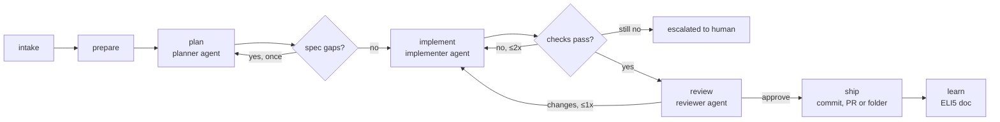

# Agent Factory — Overview

An agentic factory that takes a task (text, markdown file, GitHub issue) and
ships a reviewed branch or pull request. Autonomous by default and
semi-autonomous with flags. It is customised per team through skills and a
`factory.toml`, and runs in a container so it can move to AWS ECS/EC2 unchanged.

## 1. The task, broken down

`process.md` mixes four concerns. Splitting them keeps each module small:

| Concern       | process.md items                                   | Module                  |
|---------------|----------------------------------------------------|-------------------------|
| Flow          | steps 0-9, retries, escalation, resume/rewind       | `factory.pipeline`      |
| Thinking      | understand, grill, research, BDD + design doc       | `factory.crew` (planner)|
| Doing         | implementation with skills, review, ELI5 learning   | `factory.crew`          |
| Determinism   | intake, env prep, spec gate, checks, git, PR        | `intake`, `workspace`, `checks`, `ship` |
| Data          | everything that crosses a boundary                  | `factory.contracts`     |

The process steps mapped onto the blueprint:

| # | process.md step                  | Blueprint node | Kind          |
|---|----------------------------------|----------------|---------------|
| 0 | intake                           | `intake`       | deterministic |
| 1.1 | prep env (worktree, hydrate)   | `prepare`      | deterministic |
| 1-3 | understand, grill, research, spec | `plan`      | agent (planner) |
| 3.1 | spec has the minimum           | `plan` (gate)  | deterministic |
| 4-5 | implement, checks, 2 retries, escalate | `implement` | agent + deterministic |
| 6 | review, max 1 rework             | `review`       | agent (reviewer) + deterministic |
| 7-8 | commit, PR or folder           | `ship`         | deterministic |
| 9 | ELI5 learning doc                | `learn`        | agent (scribe) |

## 2. What the references taught us

**Stripe Minions**
- *Blueprints*: interleave deterministic nodes (git, lint, push) with agent
  nodes. Required steps always run and cost no tokens. → our pipeline is a
  plain Python sequence of steps; only four of them call an LLM.
- *Shift feedback left*: run local checks before CI. → `checks` runs
  pre-commit and configured commands inside the worktree.
- *At most two CI rounds*, then hand to a human. → `check_retries = 2`, then
  the run is `escalated`.
- *Isolated devbox, curated tools*. → a git worktree per run inside a
  container; each agent gets only the capabilities its job needs.
- *Hydrate before the run*. → `prepare` runs configured hydrate commands
  (`uv sync`, `dbt deps`, ...) before any agent starts.
- *Web UI of decisions*. → every step writes a readable artifact to
  `.factory/runs/<id>/`, and Logfire (optional) traces every agent call.

**Design Docs Are All You Need (SMART) / `design-framework.md`**
- The design doc is the source specification, and code is generated output.
  → the planner produces a `Spec` with a purpose, scope, BDD scenarios,
  worked examples, invariants, a "must not infer" list, and acceptance
  anchors. The implementer receives only this.
- Keep structure machine-readable. → `Spec` is a Pydantic model and the
  markdown version is rendered from it.
- Read it like a hostile compiler. → `Spec.gaps()` is the deterministic
  gate for step 3.1.

**Pydantic AI + harness**
- `Coder(workspace)` provides file, shell, and repo-context tools scoped to
  one directory.
- `Skills(dirs)` loads `SKILL.md` on demand, so teams customise the
  implementer for software, dbt/data, or ML/AI work without touching code.
- `SummarizingCompaction(max_tokens=170_000)` keeps context tight.
- `WebSearch(max_uses=8)` caps research at 8 searches.
- `TestModel` lets us test the whole pipeline without spending tokens.

## 3. Decisions

1. **Pydantic AI** over a Claude CLI wrapper. We need typed outputs (`Spec`,
   `Review`), per-agent models, and free tests.
2. **One planner agent for steps 1-3.** It classifies, grills (or records
   assumptions), researches, and writes the spec in one context. The
   implementer and reviewer are separate agents, so their contexts stay small.
3. **Reviewer ≠ implementer.** It uses a different agent, different
   instructions, and by default a different model. It may make small edits
   and gets at most one rework round.
4. **Files are the UI.** `run.json` is the state and the other artifacts are
   plain markdown. `factory show` prints the timeline. Logfire gives a web
   view of agent traces when `LOGFIRE_TOKEN` is set.
5. **Resume = re-run.** Finished steps are skipped. Rewind resets a step and
   every step after it.
6. **Container = sandbox.** The same image runs locally and on ECS. The
   worktree scopes the agent's filesystem.
7. **Autonomous by default.** HITL points (`grill`, `spec`, `code`) are
   opt-in via config or CLI flags.

## 4. Architecture



## 5. Layout

```text
factory/            the package, one module per design doc
docs/design/        design docs (source specification for each module)
skills/             default skills: software, data, ai
evals/              2-3 cheap end-to-end cases, run on CI
tests/              unit tests, no tokens spent
Dockerfile          the image for local, ECS, or EC2
```

## 6. Out of scope for v1 (open questions)

1. Running the reviewer as a GitHub App. v1 posts the review as a PR comment
   through `gh`, or writes `review.md` otherwise.
2. Micro-VM sandboxes (Firecracker/Modal). v1 uses the container.
   `ModalSandbox` from the harness is the natural next step.
3. Custom web UI beyond Logfire and `factory show`.
4. Rebasing on a moved base branch at ship time. v1 branches from `HEAD`
   at prepare time.
